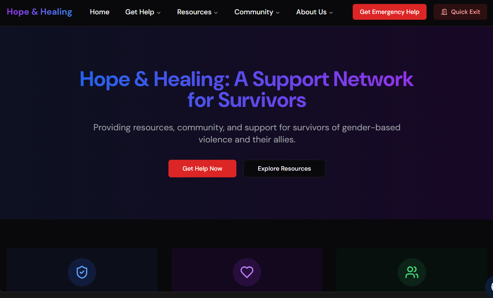

# Hope & Healing: A GBV Support Network



## About the Project

Hope & Healing is a comprehensive online hub dedicated to supporting survivors of Gender-Based Violence (GBV), their families, and allies. Our platform provides a safe, accessible space for resources, support, and community building in the fight against GBV.

## Mission

To create a supportive ecosystem that empowers survivors, educates communities, and mobilizes action against Gender-Based Violence through accessible technology and compassionate support.

## Key Features

### 🏠 Safe Spaces Directory

- Comprehensive listing of trusted shelters
- Verified counseling services
- Legal aid organizations
- Emergency contact information

### 📝 Reporting Tools & Guidance

- Clear, step-by-step reporting procedures
- Information about legal rights
- What to expect during the reporting process
- Confidential reporting options

### 💬 Community Support

- Moderated survivor stories section
- Private community forum
- Peer support networks
- Strict privacy and safety protocols

### 📚 Educational Resources

- Information on different forms of GBV
- Prevention strategies
- Bystander intervention guides
- Healthy relationship resources

### 🎯 Advocacy Tools

- Digital petitions
- Awareness campaigns
- Volunteer opportunities
- Community engagement initiatives

## Technical Stack

This project is built with modern web technologies:

- **Frontend Framework**: React with TypeScript
- **Styling**: Tailwind CSS
- **UI Components**: shadcn-ui
- **Build Tool**: Vite
- **Development**: Node.js & npm

## Getting Started

### Prerequisites

- Node.js & npm installed ([install with nvm](https://github.com/nvm-sh/nvm#installing-and-updating))

### Installation

```sh
# Clone the repository
git clone <repository-url>

# Navigate to project directory
cd healing-hope-network

# Install dependencies
npm install

# Start development server
npm run dev
```

## Contributing

We welcome contributions from developers who share our vision of creating a safer, more supportive world. Please read our contributing guidelines before submitting pull requests.

## Privacy & Security

- All user data is encrypted and stored securely
- Strict privacy protocols for survivor information
- Regular security audits
- GDPR and data protection compliance

## Support

For technical support or to report issues, please open an issue in this repository.

For emergency support or crisis intervention, please contact your local emergency services or GBV hotline.

## License

This project is licensed under the MIT License - see the LICENSE file for details.

## Acknowledgments

- All survivors who have shared their stories
- GBV support organizations worldwide
- The open-source community
- Our dedicated team of volunteers and contributors
